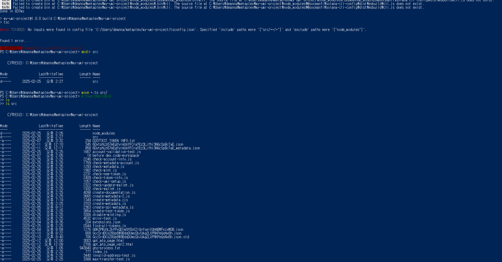
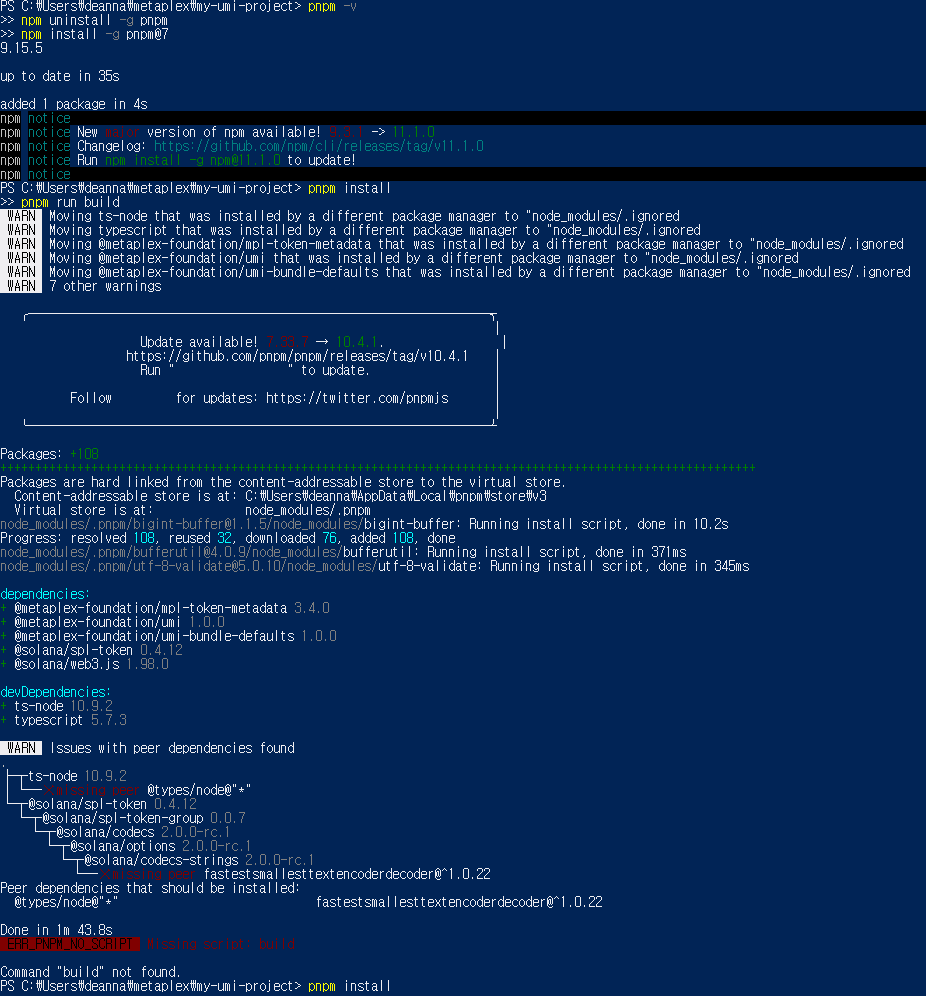

# Metadata Setup Guide

This guide explains how to set up metadata for your SPL Token on the Solana blockchain using the Metaplex JS SDK and related tools.

## Prerequisites

Before starting, ensure you have:
- Node.js (LTS version 16 or 18 recommended)
- PNPM or NPM (for installing dependencies)
- Solana CLI (for managing Solana config and keypairs)
- Cloned repository of the [Metaplex JS SDK](https://github.com/metaplex-foundation/js)


*Verify your Node.js version before proceeding*

## Overview

When creating an SPL token on Solana, you'll need to:
1. Create/mint an SPL token
2. Initialize metadata account via Metaplex
3. Update metadata (name, symbol, URI)
4. Verify on-chain metadata

## Step-by-Step Guide

### 1. Environment Setup

First, ensure your development environment is properly configured:

```bash
# Check Node.js version
node -v

# Verify PNPM installation
pnpm -v
```


*Setting up package manager with correct versions*

### 2. Project Structure

Organize your project files properly:

```bash
my-token-project/
├── src/
│   └── create-metadata.ts
├── dist/
├── package.json
└── tsconfig.json
```


*Proper project structure setup*

### 3. Install Dependencies

```bash
# Install required packages
pnpm install @metaplex-foundation/js @solana/web3.js
```

If you encounter any installation errors:


*Troubleshooting package installation issues*

### 4. Build Configuration

Set up your TypeScript configuration:

```json
{
  "compilerOptions": {
    "target": "es2020",
    "module": "commonjs",
    "outDir": "./dist"
  }
}
```


*Handling build configuration issues*

### 5. Create Metadata Script

```typescript
import { Metaplex, keypairIdentity } from "@metaplex-foundation/js";
import { Connection, clusterApiUrl, Keypair, PublicKey } from "@solana/web3.js";
import fs from "fs";

const connection = new Connection(clusterApiUrl("devnet"), "confirmed");
const wallet = Keypair.fromSecretKey(
  Uint8Array.from(JSON.parse(fs.readFileSync("./keypair.json", "utf-8")))
);
const metaplex = Metaplex.make(connection).use(keypairIdentity(wallet));

async function createMetadata() {
  const mintAddress = new PublicKey("YOUR_TOKEN_MINT_ADDRESS");
  
  try {
    const { nft } = await metaplex.nfts().create({
      uri: "https://example.com/token-metadata.json",
      name: "MOTO Protocol Token",
      symbol: "MOTO",
      mintAddress: mintAddress,
      sellerFeeBasisPoints: 0,
    });
    
    console.log("Metadata created successfully:", nft);
  } catch (error) {
    console.error("Error creating metadata:", error);
  }
}

createMetadata();
```

### 6. Build and Run

```bash
# Build the project
pnpm run build

# Run the script
node dist/create-metadata.js
```


*Successful build and execution*

## Troubleshooting Guide

### Common Issues

1. **Node Version Conflicts**
   - Use `nvm` to switch Node versions
   - Ensure compatibility with PNPM

2. **Build Errors**
   - Check TypeScript configuration
   - Verify file paths and imports
   - Ensure proper directory structure

3. **Runtime Errors**
   - Verify wallet keypair exists
   - Check network connection
   - Validate mint address

## Best Practices

1. **Version Management**
   - Use Node.js LTS versions
   - Match PNPM version with Node.js
   - Document version requirements

2. **Error Handling**
   - Implement try-catch blocks
   - Log errors properly
   - Provide clear error messages

3. **Security**
   - Never commit private keys
   - Use environment variables
   - Test on devnet first

## Resources

- [Solana SPL Token Documentation](https://spl.solana.com/token)
- [Metaplex JS SDK](https://github.com/metaplex-foundation/js)
- [Solana Web3.js](https://solana-labs.github.io/solana-web3.js)

## Next Steps

1. Create token metadata JSON
2. Update metadata if needed
3. Verify on-chain data
4. Monitor transaction status

---

> **Note:** Keep your development environment updated and refer to our [debugging notes](../journey/debugging-notes.md) for detailed troubleshooting steps.
