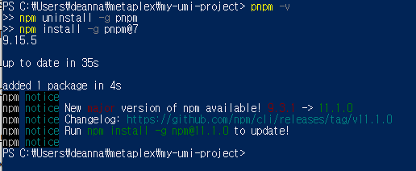
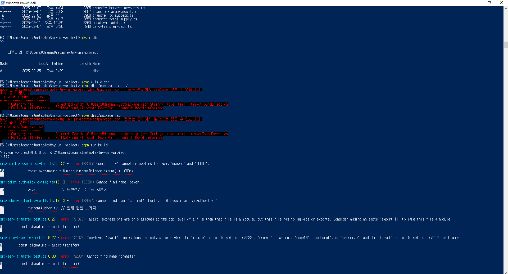

# Environment Setup

This document describes how to configure your local development environment for the **MOTO PROTOCOL SPL Token Project**. It includes:

1. Checking and switching Node.js versions
2. Managing PNPM versions
3. Handling build or installation errors
4. Adjusting file structures for TypeScript compilation
5. Example screenshots of each step

> **Note:** These steps are demonstrated on a Windows environment, but the general approach applies to other OS as well.

---

## 1. Checking Node.js Versions

When working with Metaplex or Umi-based projects, Node.js 16 LTS or 18 LTS is recommended to avoid compatibility issues. Non-LTS or cutting-edge versions (like 22.x) may cause errors with workspaces or build tools.

1. **Check your current Node version and list installed versions:**

```sh
node -v
nvm list
```

Switch to Node 16 or 18 if necessary:

```sh
nvm install 16.20.0
nvm use 16.20.0
# or
nvm install 18.14.0
nvm use 18.14.0
```

Verify your active Node.js version:

```sh
node -v
```


*In this image, you can see the commands node -v and nvm list, showing Node.js versions 18.14.0, 22.13, and 16.20.0.*

## 2. Package Manager Setup

### 2.1 PNPM vs. Node Version
- If you are on Node 16, you often need PNPM 7.x to avoid errors.
- If you are on Node 18, you can generally use the latest PNPM (9.x or above).

Check your PNPM version:
```sh
pnpm -v
```

If PNPM requires Node 18 but you want Node 16 (or vice versa), you might see errors like `ERROR: This version of pnpm requires at least Node.js v18.12`.

```sh
npm uninstall -g pnpm
npm install -g pnpm@7
```


*Demonstrates running pnpm -v, uninstalling, reinstalling PNPM, etc.*

## 3. Handling PNPM Installation Errors

Sometimes installing or upgrading PNPM leads to immediate errors (e.g., "Unsupported URL Type 'workspace:*'").


*Here you can see the user running pnpm -v, then npm uninstall -g pnpm, npm install -g pnpm@7, and an error occurs.*

## 4. Attempting a Build (PNPM)

After installing or updating PNPM, you'll typically run:

```sh
pnpm install
pnpm run build
```


*Shows a user running pnpm install and pnpm run build with resulting errors.*

## 5. File Structure Setup

When working with TypeScript, you often need a src folder (referenced in tsconfig.json). If your .ts files are in the root folder, you'll see an error about "No inputs were found."

Steps:
1. Create src/
2. Move .ts files into src/
3. Verify or update tsconfig.json to include "src/**/*"


*Demonstrates using mkdir src, move *.ts src/, and ls src.*

## 6. Dist Folder and Build Errors

If you create a dist/ folder and move .js files there manually, TypeScript or PNPM may not know where to place compiled outputs.


*Shows the user doing mkdir dist, move *.js dist, and then pnpm run build failing.*

## 7. Final Build Success

Sometimes you'll need to remove or rename a problematic file to fix a TypeScript conflict. After that, re-running pnpm run build might succeed.


*Shows the user deleting the problematic file and re-running the build successfully.*

## 8. Tips & FAQ

**Q1. "I keep getting TypeScript errors about missing names or top-level await."**  
A1: Ensure your tsconfig.json includes "target": "es2020" or higher (like "esnext") and that your code has import or export statements at the top if using top-level await.

**Q2. "Unsupported URL Type 'workspace:' error."**  
A2: Usually a mismatch in Node.js ↔ PNPM versions. Switch to Node 16 or 18 and use a PNPM version that supports it.

**Q3. "Resource in use" error on Windows when deleting a folder.**  
A3: Close all terminals/explorer windows referencing that folder, or open a new admin PowerShell to remove it.

**Q4. "No inputs were found in config file" (TypeScript error).**  
A4: Check your tsconfig.json include paths (e.g., "src/**/*") and ensure your .ts files are inside src/.

## 9. Conclusion

By aligning Node.js (16 or 18) with the correct PNPM version (7.x for Node 16, 9.x for Node 18) and maintaining a consistent file structure for TypeScript, you can avoid most environment setup issues. If errors persist, refer to the screenshots above or the FAQ for common troubleshooting steps.

For more details, see:
- [Node.js Official Site](https://nodejs.org/)
- [PNPM Documentation](https://pnpm.io/)
- [TypeScript Docs](https://www.typescriptlang.org/docs/)
- [nvm-windows on GitHub](https://github.com/coreybutler/nvm-windows)
