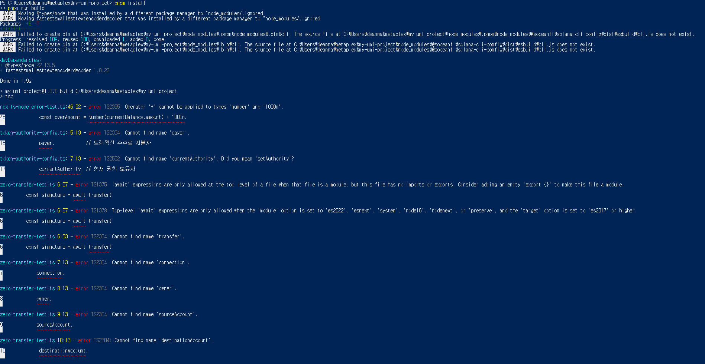

# Lessons Learned

This document summarizes key insights and lessons learned during the development of the **MOTO PROTOCOL SPL Token Project**. These learnings are particularly valuable for DevRel professionals and developers working with Solana and Metaplex.

## 1. Environment Management

### Version Control Best Practices


#### What We Learned
- Always start with LTS versions of Node.js (16.x or 18.x)
- Use version managers (nvm) consistently
- Document version requirements clearly

#### Impact
- Reduced setup time for new team members
- Fewer version-related conflicts
- More stable development environment

## 2. Package Manager Configuration

### PNPM Setup and Management


#### What We Learned
- Match PNPM version with Node.js version
- Use version-specific installations
- Document dependency relationships

#### Impact
- Consistent package management
- Fewer dependency conflicts
- Faster installations

## 3. Installation Troubleshooting

### Common Installation Issues


#### What We Learned
- Handle workspace protocol issues
- Resolve dependency conflicts
- Maintain clear configuration

#### Impact
- Faster problem resolution
- Better error handling
- Improved documentation

## 4. Build Process Management

### Build Configuration


#### What We Learned
- Verify TypeScript configuration
- Check build scripts
- Monitor compilation process

#### Impact
- More reliable builds
- Easier debugging
- Better error messages

## 5. Project Structure Organization

### Directory Management


#### What We Learned
- Organize source files properly
- Maintain clear directory structure
- Follow TypeScript best practices

#### Impact
- Better code organization
- Easier maintenance
- Improved collaboration

## 6. Distribution Management

### Output Configuration


#### What We Learned
- Configure output directories correctly
- Manage build artifacts
- Handle distribution files

#### Impact
- Cleaner builds
- Better deployment process
- Reduced errors

## 7. Success Patterns

### Achieving Stable Builds


#### What We Learned
- Follow systematic approach
- Document successful patterns
- Maintain consistency

#### Impact
- Reproducible success
- Faster onboarding
- Better team efficiency

## Key Takeaways

### 1. Documentation is Critical
- Write documentation as you go
- Include screenshots and examples
- Keep it updated and relevant

### 2. Error Management
- Create detailed error logs
- Document resolution steps
- Share solutions with team

### 3. Development Workflow
- Establish clear processes
- Use consistent tools
- Maintain version control

## Best Practices Established

### 1. Setup and Configuration
```bash
# Example of standardized setup
nvm use 16
npm install -g pnpm@7
pnpm install
```

### 2. Error Prevention
```bash
# Pre-build checklist
- Check Node.js version
- Verify PNPM version
- Validate tsconfig.json
```

### 3. Quality Assurance
```bash
# Standard testing process
- Run unit tests
- Check build output
- Verify documentation
```

## Future Improvements

### 1. Automation
- Build process automation
- Testing automation
- Documentation updates

### 2. Documentation
- More interactive guides
- Video tutorials
- Better error guides

### 3. Community
- Regular workshops
- Community calls
- Better feedback loops

## Conclusion

These lessons learned have significantly improved our development process and will continue to guide future improvements. Key focus areas remain:

1. **Documentation Quality**
   - Keep improving clarity
   - Add more examples
   - Update regularly

2. **Process Improvement**
   - Streamline setup
   - Enhance automation
   - Reduce errors

3. **Community Support**
   - Better engagement
   - Faster responses
   - More resources

---

> **Note:** This document is regularly updated with new insights and lessons learned. Last updated: [Current Date]
